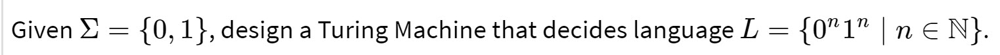

# A Turing Machine Simulator

**Author:** Stephen Tse \<[redacted]@cmu.edu\>

This is a simulation of a simple [Turing Machine](https://en.wikipedia.org/wiki/Turing_machine). By definition it's as powerful as you'll ever get as a computing machine, so feel free to use it to solve any solvable problems you can think of ;p

Note that this implementation assumes a finite length of input tape (adjustable by `TAPE_LEN` in `Turing.java`). You may code up your algorithms in `Main.java`, the main driver of the turing machine. For now it solves a simple problem out of the box (too bad GitHub README doesn't support LaTex rendering...):

</img>
